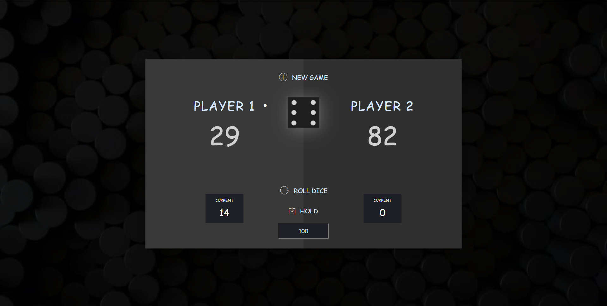

# Pig : Dice Game

Pig is a simple, two-player dice game first described in print by John Scarne in 1945. Players take turns to roll a single die as many times as they wish, adding all roll results to a running total, but losing their gained score for the turn if they roll a 1.

How it goes:
1. Before starting the game, the two players decide on a final score by entering a number at the bottom

2. On a player's turn, he or she may roll the dice repeatedly. The numbers of the dice rolls will accumulate in the player's current score.

3. If a player rolls a 1, his or her current score is reset to 0 and the other player receives their turn.

4. A player can choose to hold (stop rolling the die) at any time during their turn in order to add his or her current score to the total score.

5. The first player to surpass the final score with his or her total score wins.

